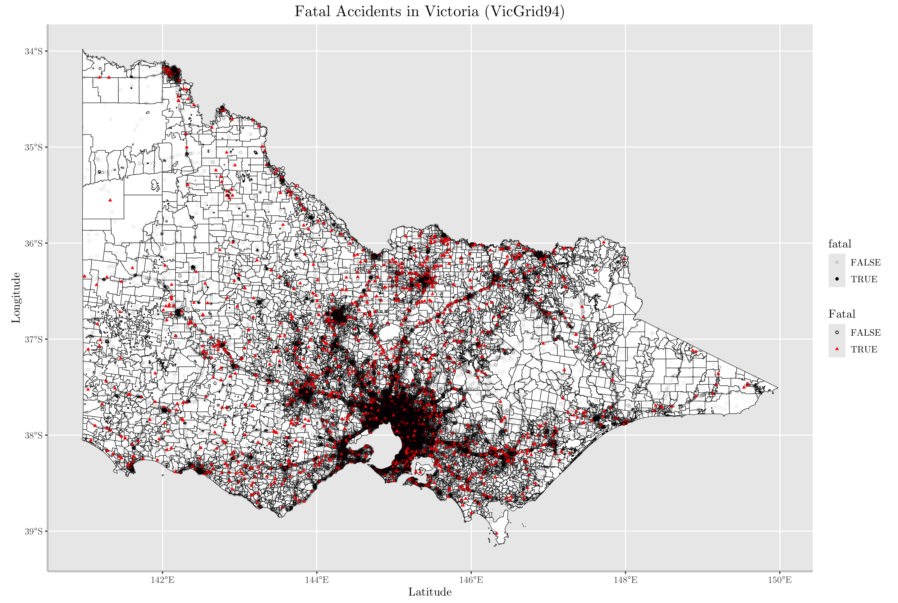

# VicRoads Fatalities
## Project Background
_VicRoads_ is a government agency which manages the road network, motor registration, and ensuring safe and efficient transport systems. In addition to road management, VicRoads is also responsible for promoting road safety. Under _Lyra Technologies_, our goal was twofold:
1. to **gather insights** about which driver and vehicle profiles would be more likely to be involved in fatal accidents, and
2. to create a **predictive model** for whether a certain accident, given the location, vehicle, and driver data would be fatal, meaning at least one person died as a result of the accident.
This project would allow clients to understand which drivers are high-risk and to implement data-driven policies and/or to create a marketing campaign to inform and educate road users on safety related issues. It would also allow for the prediction of the fatality of accidents which could provide insights to cracks within first-responders and the emergency health systems in Victoria, allowing the industry to better respond to road-related incidents. 

## Executive Summary
The xGBoost model had the best model performance and yielded an **AUC of 0.9510**. The model was trained on 250000 datapoints with 982 features on the accident, vehicle, person and geographic data provided from VicRoads. We performed data analysis and wrangling including **Principal Components Analysis** (PCA) for dimension reduction, **Synthetic Minority Oversampling Techniques** (SMOTE) for dealing with a 1.5% minority class imbalance, and **Bayesian Search** for hyperparameter tuning. We trained a Feedforward Neural Network (FNN) and an xGBoost model and found the xGBoost model outperformed the other models. 

The top 10 most important variables in determining whether an accident was fatal are:
1. Degree of urbanisation
2. Police attendence 
3. Vehicle towed away
4. Vehicle level of damage
5. Vehicle make
6. Accident type
7. Vehicle type
8. Speed zone
9. Caught fire
10. DCA code

## Data Exploration and Insights
### Data Sources and Wrangling
The data was attained from VicRoads as a publically available dataset [here](https://opendata.transport.vic.gov.au/dataset/victoria-road-crash-data). It contains data from 2012 to 2023 including _accident_ (basic accident details, time, severity, location), _person_ (person based details, age, gender etc), _vehicle_ (vehicle based data, vehicle type, make etc), _accident_event_ (sequence of events e.g. left road, rollover, caught fire), _road_surface_cond_ (whether road was wet, dry, icy etc), _atmospheric_cond_ (rain, winds etc), _sub_dca_ (detailed codes describing accident), _accident_node_ (master location table), and _Node Table_ with Lat/Long references.

The main difficulty was with deciding how to properly join the data from each individual .csv file so that modelling could be done. We decided to use the accident_id and vehicle_id as our identifiers in the dataset - that is, each row corresponds to each car that was involved in each accident and the driver's details were kept. This meant that any event-level details (such as what parts the car collided with, and the sequence of events) were maintained using binary encoding (e.g. 1 if the car hit an object, and 0 otherwise). 

The next major issue was the handling of missing and NA values in the dataset. Some columns had an abundance of NA's which we decided to keep as a separate 'Unknown' category, as neither imputation nor removal seemed valid. However for many columns both categorical and numerical, we opted to utilise xGBoost for regression and classification to impute the missing values. We selected the features that were highly relevant to each column to be imputed and utilised Bayesian Search for the hyperparameters. The choice of whether to retain the NA's as a separate category depended on our intuition about whether or not certain variables were dependent on the data available.

### Key Insights
The general methodology for gathering insights required that we realise we could not infer the distribution of certain variables by their availability in our dataset because we could not know whether the data was a complete record of all accidents that occured within this time frame, as there may have been missing records, or unavailable data not included in the data. For example, we would hesitate to claim that because there was 40% females in the data available, that therefore males are more likely to be involved in accidents. Instead, we aimed to understand whether males or females were more likely to be involved in fatal accidents - that is, for example, 1.8% of men who had been involved in an accident were involved in a fatal accident, whereas that number was 0.75% for females. 

From the data visualisation found in the Graphs section, we make the following observations with the numbers (1) giving reference to the graphs
- There was a seasonal trend in 2020-2022 which corresponded to a drop in accidents during lockdown periods (2)
- The Dec-Jan period has less accidents than the rest of the year (3)
- There are holiday specific averages that deviate from the standard
- More accidents happen at peak hours (4)
- Weekends do not follow the same pattern as weekdays (5)
- Although less accidents happen in the late nights (12am-4am), they are more fatal (4 & 9)
- Severity in the late nights is the same across weekends and weekdays (10)
- Collision with fixed objects are the most fatal accident type (11)
- Weekends are more fatal than weekdays (12)
- Accidents that happen in the dark without street lights are the most fatal (13)
- Multi-car (2+) accidents are less fatal than single car accidents (14)
- Accidents that occur not at intersections are most fatal (16)
- Accidents at higher speeds are more fatal (17)
- Accidents involving large vehicles (prime movers) are more fatal (23)
- Accidents involving vehicles with large seating capacities (40-50) are more likely to be fatal (27)
- Overtaking and going the wrong way are the most fatal types of accidents (31)
- Accidents where the vehicle caught fire are significantly more fatal (32)
- Accidents where the top/roof was the initial impact are most fatal whereas rear end collisions are the least fatal (34)
- Accidents with no traffic control are most fatal (36)
- Males are more likely to be involved in fatal accidents than women (40)
- If seatbelt or helmets are not worn, the accident is more likely to be fatal (42)
- If the driver was ejected, the accident is more likely to be fatal (46)

[View the interactive Plotly graph](https://whsnicholas.github.io/VicRoads-Fatalities/accident_date_agg_plotly.html)

## Machine Learning Methods
Before we built any ML models, the data was preprocessed with the following steps. Firstly we one-hot encoded all categorical variables, some of which were very high dimensional, which we adressed later. Next some basic feature engineering was conducted: is_holiday (binary variable indicating whether the date was a public holiday), engine_efficiency (cylinders/age) and distance_to_cbd_km (distance to Melbourne CBD). We then scaled the data using the standard scaler. In order to address the high dimensionality of our data, we performed Principal Components Analysis for certain high dimensional columns in order to retain 76% of the variance. This reduced the number of columns in the data significantly. After checking using an initial xGBoost model the feature importance, we implemented Synthetic Minority Oversampling Techniques (SMOTE) in order to address the significant class imbalance. The data had only 1.5% of its cases having been fatal, with the remaining 98.5% being non-fatal accidents. This presents a problem when performing classification because if we 'built' a naive model that always predicted Not Fatal, we would be correct 98.5% of the time, providing an accuracy of 98.5% (another reason as to why accuracy is not a good metric). This looks good on paper but really our model has learnt absolutely nothing about predicting fatal accidents. Hence we need to address this issue firstly by considering metrics apart from accuracy, as well as by oversampling the minority class in our data so that we can learn from a more balanced dataset. We implemented SMOTE, ADASYN, BorderlineSMOTE and SMOTETomek, experimenting with different values for k_neighbours. We found that ADASYN performed best, improving our recall from 0.02 to 0.45. While not a perfect classifier, a significant improvement. This allowed for much improved model performance in both the xGBoost and Neural Network models.

The xGBoost model was trained using the ADASYN oversampled data using a binary logistic objective function. The hyperparameters were tuned using the validation set and using Bayes Search. Due to the significant number of parameters, a grid search was computationally too expensive, and hence as opposed to random guessing, a Bayesian approach was taken, adapting the random parameters based on previous models' performance. L1 regularisation was also included for model robustness. The model was then evaluated usiing primarily the AUC and F1 metric, and we chose a threshold such that we maximise the F1 score. The model was then retrained on the training + validation sets and evaluated on the test data. The results are presented below

**XGBoost Evaluation Results:**
_Accuracy_: 0.98314263
_Precision_: 0.46720214
_Recall_: 0.50215827
_F1 Score_: 0.48404993
_AUC-ROC_: 0.96209680
_Best threshold for F1_: 0.053136785

**Confusion Matrix for xGBoost Model: **

| Actual \ Predicted | Non Fatal | Fatal |
|--------------------|----------|----------|
| Non Fatal     | TN = 43042 | FP = 398 |
| Fatal | FN = 346 | TP = 349 |

The Neural Network architecture consisted of a Feed Forward Neural Network with 2 hidden layers, the first with 64 neurons, and the second with 16 neurons. We found that networks with fewer hidden layers and neurons were less prone to overfitting and hence performed better. We used a dropout rate of 40% again to circumvent overfitting and used the hyperbolic tangent activation function on both layers, which seemed to provide better results. The choice of optimiser was the Stochastic Gradient Descent, which significantly outperformed the Adam Optimiser, while sacrificing some computational efficienct. We found that lower learning rates generalised the networks better when combined with more epochs. Early stopping was used to prevent overfitting. The model results are presented below

**Neural Network Evaluation Results**:
_Accuracy_: 0.97765945
_Precision_: 0.27371695
_Recall_: 0.25323741
_F1 Score_: 0.26307922
_AUC-ROC_: 0.90470257
_Best threshold for F1_: 0.9165825

**Confusion Matrix for Neural Network Model**: 

| Actual \ Predicted | Non Fatal | Fatal |
|--------------------|----------|----------|
| Non Fatal     | TN = 42973 | FP = 467 |
| Fatal | FN = 519 | TP = 176 |

Our intuition as to why the xGBoost model outperformed the Neural Network is because neural networks better model continuous functions as shown by the Universal Approximation Theorem. Tree based methods are stepwise by design and hence seem to work well for classification of data which has a large amount of categorical data. The Neural Network represents the categorical data as continuous values which seem to give the xGBoost model an advantage. 

## Results and Recommendations
Our xGBoost built performs well and is optimised for a balance of precision and recall, and uses state-of-the-art machine learning techniques, combined with an abundance of data to predict whether a given accident will be fatal or not. We gained new insights into driver and accident characteristics that might impact the severity and hence the fatality of motor accidents and suggest that data-driven policies and regulations for example regarding speeding and seat belts are implemented. Furthermore, our research demonstrates a capacity to learn from a significantly class imbalanced dataset using a combination of sound data cleaning techniques, as well as sound model evaluation and training methods. 

